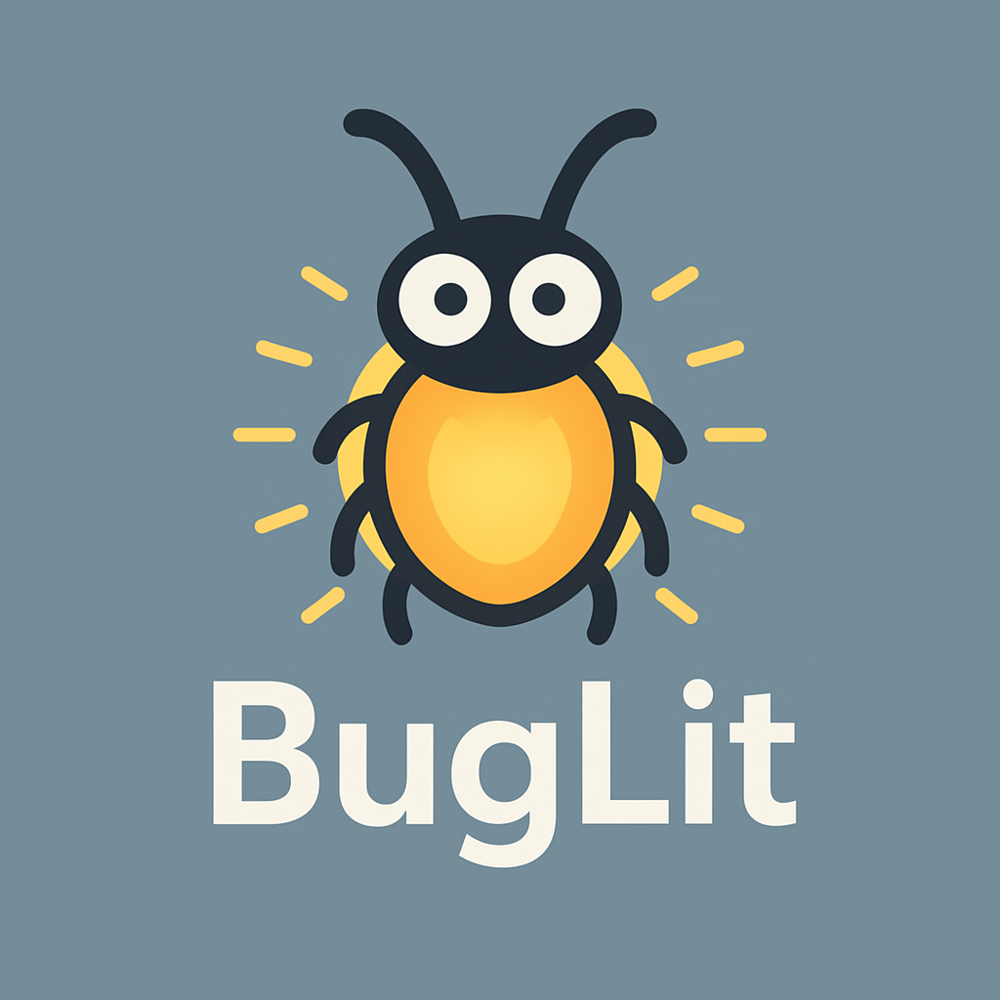

#   Smart Link & Text Highlighter for the Web

**BugLit** is a Chrome extension that highlights user-defined **links** and **text** on any webpage — perfect for developers, QA testers, designers, and anyone who needs to visually track specific terms or URLs in real time.

---

## ✨ Features

- 🔍 **Highlight links and text** based on your custom keywords or URLs
- ⚡ **Auto-highlight** as you browse — no button clicking required
- ⏱️ **Optional delay** for auto-highlight
- 🌙 **Minimal & clean UI** built for quick use
- 🧽 **One-click removal** of all highlights
- 🗂️ **Persistent settings** — your terms and options stay saved

---

## 🛠 How It Works

1. Click the BugLit extension icon 🐞
2. Enter one or more search terms (e.g. `https://example.com`, `submit`, `Mammogram`)
3. Choose whether to auto-highlight on page load
4. Optionally set a delay (in milliseconds) before highlighting
5. Click **"Highlight Links/Text"** — or let it auto-run
6. To clean up the page, click **"Remove Highlights"**

---

## 📦 Installation

### From Source

1. Clone or download this repo
2. Open Chrome and go to `chrome://extensions`
3. Enable **Developer Mode**
4. Click **Load unpacked** and select the folder
5. BugLit is now active in your toolbar

---

## 🔐 Permissions

BugLit uses:
- `storage` to save your keywords and settings
- `activeTab` and `scripting` to inject the highlight logic into the current page
- It **does not track, store, or send any data** — everything stays on your device

---

## 🧪 Use Cases

- Highlight QA test elements 
- Scan content-heavy pages for URLs or phrases
- Quickly identify link destinations during audits
- Assistive visual cue for accessibility or low-vision users

---

## 💡 Tips

- Use **delays** (e.g. 1000–3000 ms) 
- Highlight **text phrases** to catch labels, headlines, or button text
- Combine with DevTools for deeper debugging

---

## 🧩 Coming Soon (Ideas)

- Regex support
- Import/export search term sets
- Dark theme option
- Highlight count badge

---

## 👋 Credits

Made with ☕ and 💡 by Nate Blazier  

---

## 📄 License

MIT License — free to use, modify, and share.

